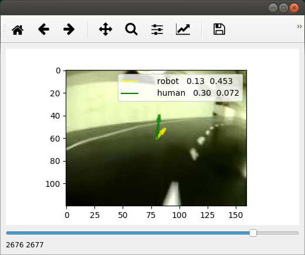

# DonkeyVis

Visualization tool for [donkey car](https://github.com/autorope/donkeycar) tubs and models.

The tool shows
* images from a specified tub
* steering vectors (throttle+angle) stored in record*.json files
* steering vectors generated by a trained model 

The model should be specified by the path to it's class, 
for example, `donkeycar.parts.keras.KerasLinear`.




## Install

```
pip install git+https://github.com/serge-m/donkeyvis.git
```


## Usage

Example:
```
donkeyvis --model donkeycar.parts.keras.KerasLinear --snapshot ../train_car_dev/models/first_try.h5 --tub ../tubs_from_may_31/tub_11_18-05-31/
```